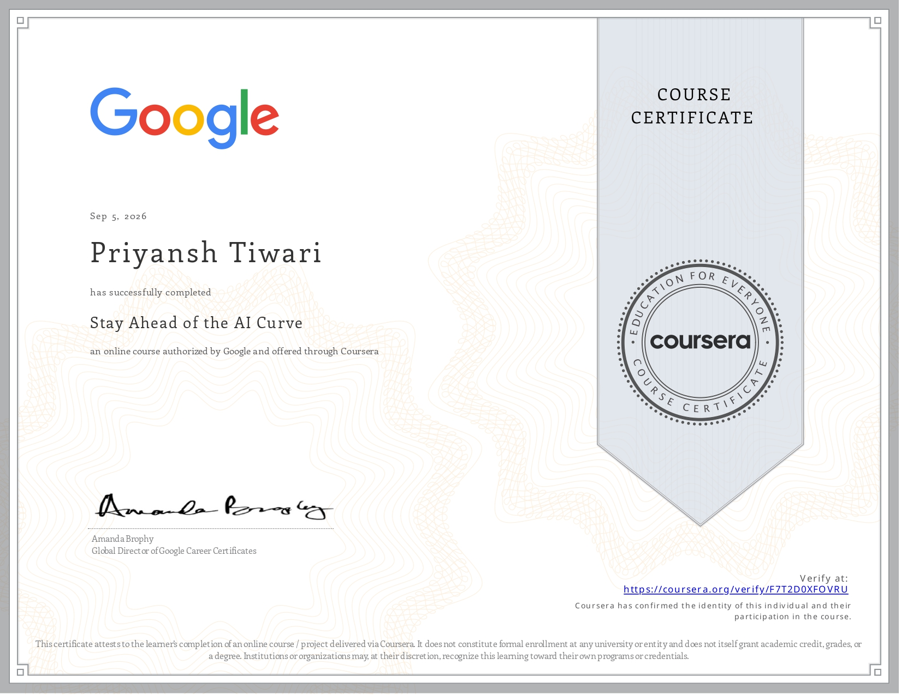
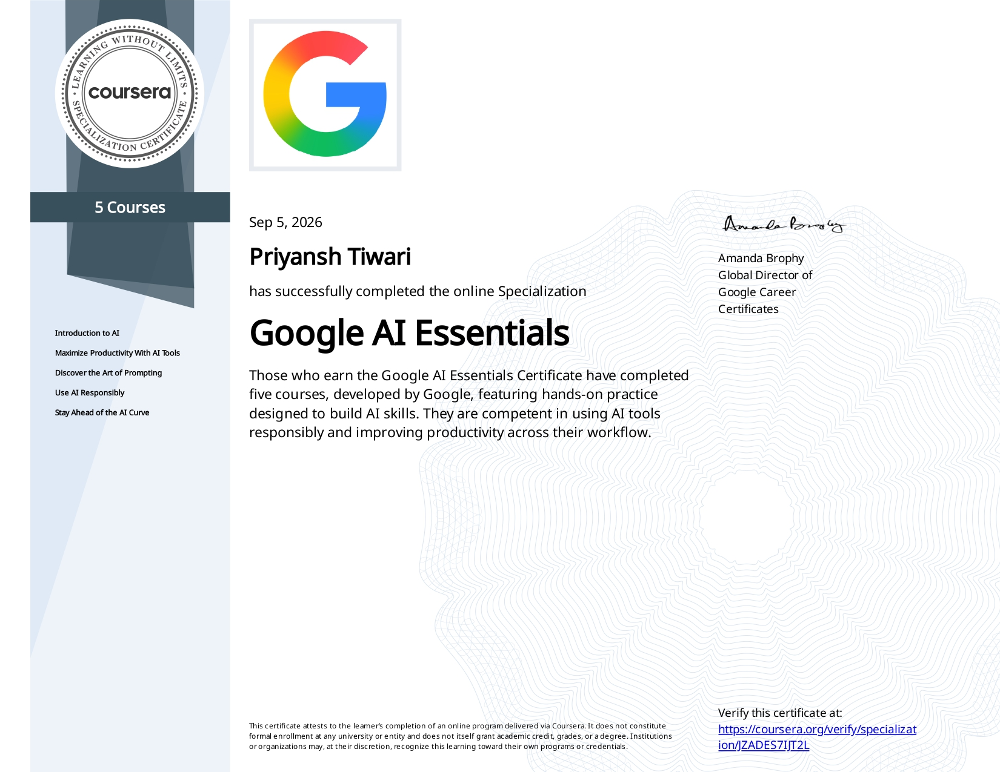
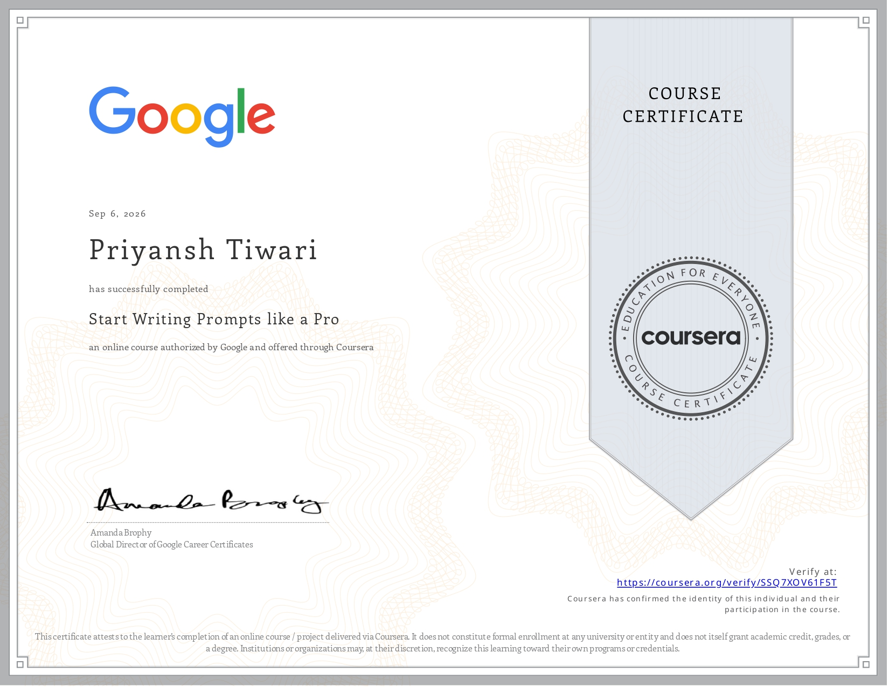
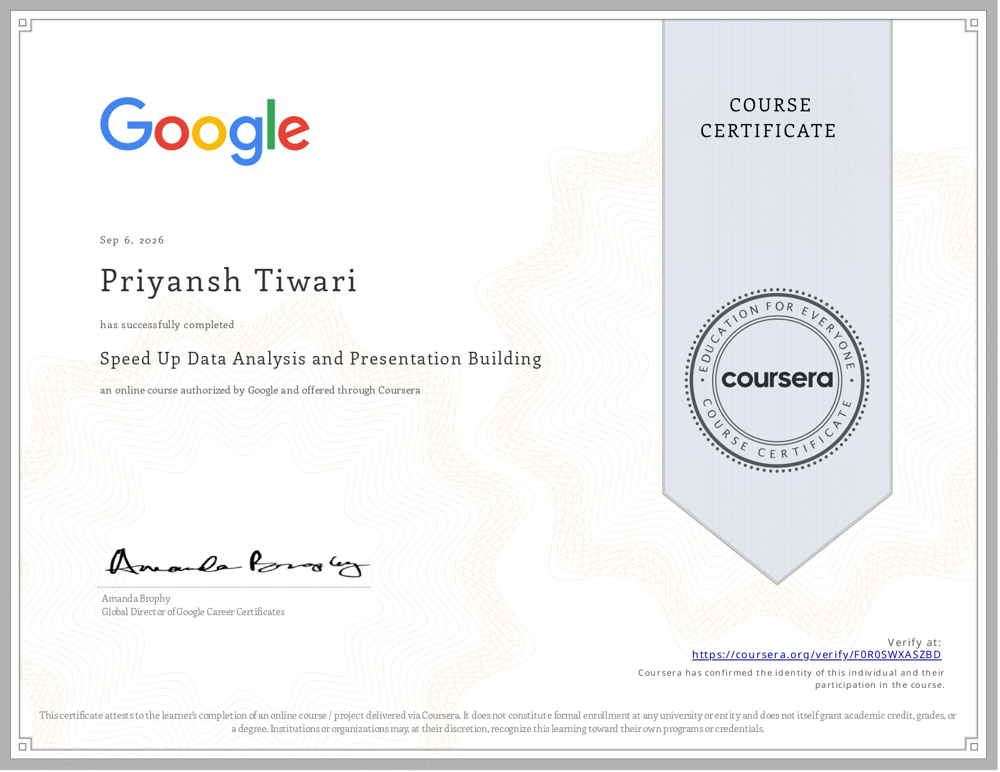
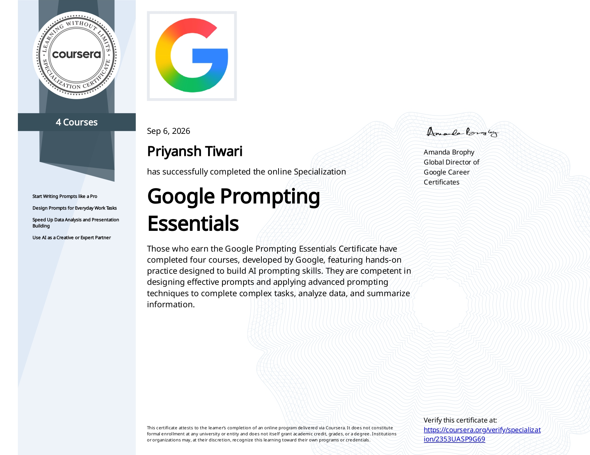

  

###

<h1 align="left">Hi, I am Priyansh!</h1>

###
<h2 align="left">About me</h2>

###

I'm a Full Stack Developer and CS-AIML student passionate about building intelligent applications and solving complex algorithmic challenges.

*  **Studying:** CSE (AI & ML).
*  **Currently Learning:** Crafting immersive 3D and interactive web experiences.
*  **Hackathons & CP:** Active competitor in global coding contests 
*  **Goals:** To provide my absolute best to the world through clean, innovative code.
*  **Let's Connect:** Reach me on X and LinkedIn.

###

<h2 align="left">Tech Stack</h2>
<h3>Artificial Intelligence & Machine Learning (AIML)</h3>
  

    <!-- Models & Assistants -->
    
    
    
    
    
    <!-- Frameworks & Libraries -->
    
    
    
    
    
    
    
    
    
    <!-- AI Tools & Environments -->
    
    
    
  

  <h3>Web Development</h3>
  

    <!-- Frontend -->
    
    
    
    
    
    
    
    
    
    
    
    
    <!-- Backend -->
    
    
    
    
    <!-- Databases -->
    
    
    
    
    
    
    
    <!-- ORMs & Validation -->
    
    
    
    <!-- APIs, Tooling & Build -->
    
    
    
    
    
    
    
    
    
  

  <h3>Programming Languages</h3>
  

    
    
    
    
    
  

  <h3>Cloud, DevOps & Hosting</h3>
  

    
    
    
    
    
    
    
    
    
    
    
  

  <h3>Design & Creative</h3>
  

    
    
    
    
    
    
    
    
    
    
    
  

  <h3>Productivity, Workflow</h3>
  

    
    
    
    
    
  

  <h3>Editors & IDEs</h3>
  

    
    
    
    
  

  <h3>OS & Browsers</h3>
  

    
    
    
    
    
    
  

  ### 🏅 Certifications & Badges

| | | | |
| :---: | :---: | :---: | :---: |
|  Introduction to AI |  Maximize Productivity AI Tools |  Discover the Art of Prompting |  Use AI Responsibly |
|  Stay Ahead of the AI Curve |  Google AI Essentials |  Start Writing Prompts like a Pro |  Design Prompts for Everyday Work Tasks |
|  Speed Up Data Analysis and Presentation Building |  Use AI as a Creative or Expert Partner |  Google Prompting Essentials | |
